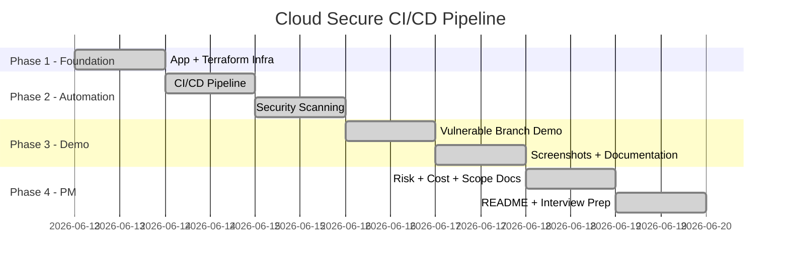

# Project Schedule — Cloud Secure CI/CD Pipeline
> Planned as a 6-day portfolio build | Status: Delivered June 2026



## Day-by-Day Delivery Plan

| Day | Phase | Deliverable | Time | Dependencies | Status |
|-----|-------|------------|------|-------------|--------|
| 1 | Foundation | App (Express.js) + Terraform (VPC, EC2, S3 backend, security group) | 2 hrs evening | None | Complete |
| 2 | Automation | GitHub Actions pipeline (scan → plan → apply → smoke test) | 2 hrs evening | Day 1 infra | Complete |
| 3 | Security | tfsec + Checkov + npm audit integrated as deployment gates | 3 hrs weekend | Day 2 pipeline | Complete |
| 4 | Demo | Vulnerable branch / PR proving the gate blocks bad infrastructure | 3 hrs weekend | Day 3 security gates | Complete |
| 5 | PM Docs | Risk register, cost estimate, scope statement, schedule | 2 hrs evening | Days 1-4 complete | Complete |
| 6 | Ship | README, screenshots, cleanup, interview story | 2 hrs evening | All prior phases | Complete |

## Critical Path

```text
Day 1 (infra) -> Day 2 (pipeline) -> Day 3 (security scanning)
                                            |
                                            v
                              Day 4 (blocked-deploy demo)
                                            |
                                            v
                              Day 5 (PM artifacts)
                                            |
                                            v
                              Day 6 (README + polish)
```

## Delivery Notes

- The critical dependency was getting security scanning to run before Terraform plan/apply.
- The demo branch validated the key control: unsafe infrastructure fails before deployment.
- The final workflow evidence shows `main` passing all gates while the vulnerable demo fails at tfsec.
- Future v2 work can add OIDC, ECS/containerization, and multi-environment promotion without changing the core portfolio story.
